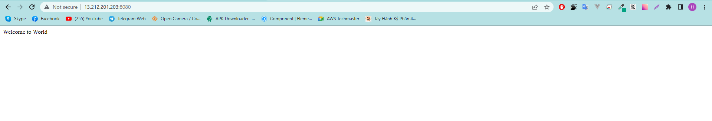
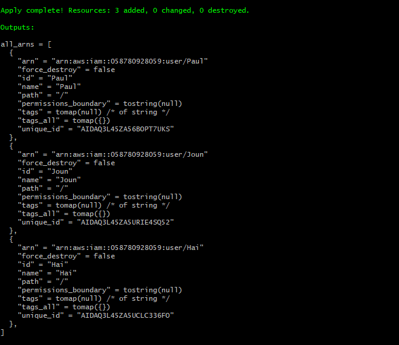
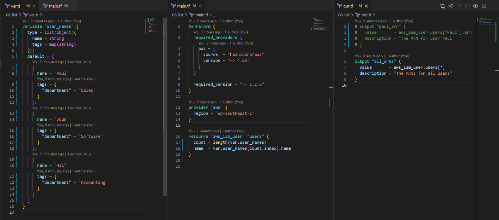
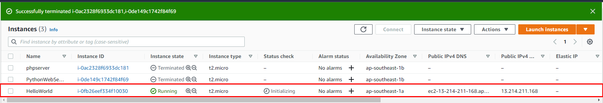
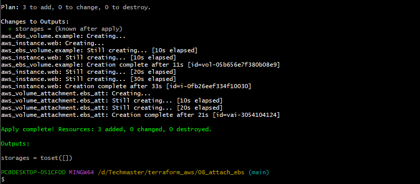

# Home Work  

#HW: Hãy fix lỗi bài 04_ec2_web_vars  

Nguyên nhân: Do khi chạy lệnh "t apply" đồng nghĩa với việc stop and start EC2 instance , mà user_data chỉ chạy lần đầu tiên  
=> Cần thêm đoạn script vào user_data để EC2 luôn chạy script trong user_data khi khởi động  

#HW: Cải tiến code 06_list để mỗi user có một tag department cụ thể  

#HW: Fix bug bài lab 08_attach_ebs  

